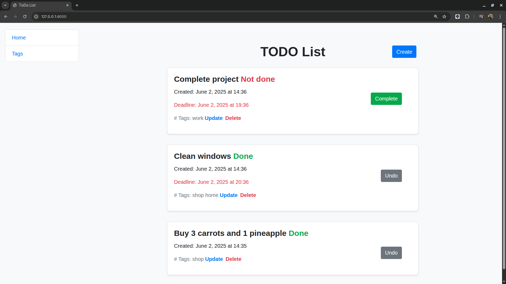
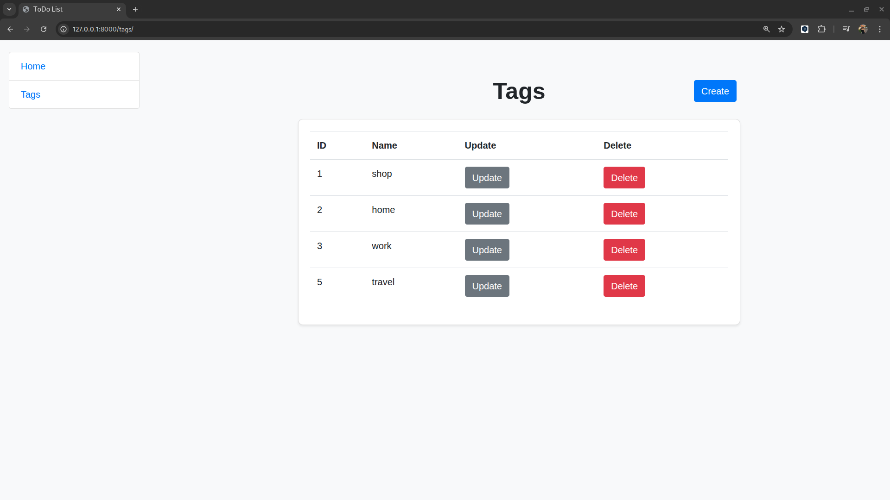

# 📝 Django TODO List

A simple web application for managing personal tasks. Users can create, update, delete, and toggle the completion status of tasks. Built with Django and styled using Bootstrap 4.

---

## ⚙️ Features

- Create new tasks
- Edit existing tasks
- Delete tasks
- Mark tasks as complete or incomplete
- Sort tasks by status and date
- Tag tasks with labels

---

## 🛠️ Technologies Used

- Python 3.x
- Django 5.x
- Bootstrap 4
- HTML5 / CSS3
- SQLite (default database)

---

## 🚀 Installation

1. **Clone the repository:**

   ```bash
   git clone https://github.com/your-username/todo-django.git
   cd todo-django
   ```
   
2. **Create a virtual environment**
    
    ```bash
    python -m venv .venv
    source .venv/bin/activate  # On Windows: .venv\Scripts\activate
    ```

3. **Install dependencies**

    ```bash
    pip install -r requirements.txt
    ```

4. **Create a `.env` file and add your secret key**

    ```bash
    echo "SECRET_KEY=your_secret_key_here" > .env
    ```

5. **Apply migrations and run the development server**

    ```bash
    python manage.py migrate
    python manage.py runserver
    ```

6. **Open in your browser**

    ```bash
    http://127.0.0.1:8000/
    ```

---

## 📊 Screenshots
* Task list page

* Tag list page


---

## 👨‍💼 Author

* Ihor Dmytriv
* Built during a Django course to practice backend web development

---

Feel free to contribute or fork the project!
